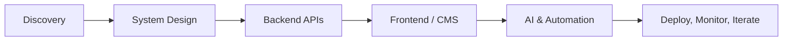

<div align="center">
  <a href="https://deepaksharma-39.github.io/">
    
  </a>
</div>

<div align="center">
  
</div>

<div align="center">
  <a href="https://deepaksharma-39.github.io/"></a>
  <a href="https://deepaksharma-39.github.io/projects.html"></a>
  <a href="mailto:deepaksharmaa.39@gmail.com"></a>
  <a href="https://www.linkedin.com/in/d33pak-sharma/"></a>
</div>

<br />

<table>
<tr>
<td width="58%" valign="top">

## 👋 About Me

I build **production-ready digital systems** — not just screens or scripts.

My work sits at the intersection of **full-stack engineering**, **CMS and admin systems**, **AI automation**, **IoT dashboards**, and **business workflow optimization**. I help turn rough ideas, legacy dashboards, and manual workflows into reliable products that can be launched, managed, scaled, and improved over time.

I care about clean UX, maintainable backend architecture, operational visibility, and systems that survive real users, real devices, and real business pressure.

</td>
<td width="42%" valign="top">

```yaml
name: Deepak Sharma
role: Full-Stack + AI Integration Engineer
focus:
  - Custom app development
  - CMS optimization & management
  - AI / LLM workflow integration
  - IoT and device dashboards
  - Production system architecture
available_for: New projects, consulting, builds
location: India · remote-friendly
```

</td>
</tr>
</table>

---

## 🚀 What I Build

<table>
<tr>
<td width="50%" valign="top">

### 🧩 Custom Apps & Platforms

- SaaS-style web applications
- Business dashboards and internal tools
- Customer-facing portals
- React / Next.js frontends
- Node.js / Express APIs
- Scalable data models and integrations

</td>
<td width="50%" valign="top">

### ⚙️ CMS Optimization & Management

- Existing CMS cleanup and modernization
- Admin panels for products, orders, users, bookings, and operations
- Performance and UX improvements
- Role-based workflows and analytics
- Long-term application maintenance

</td>
</tr>
<tr>
<td width="50%" valign="top">

### 🧠 AI Integration & Automation

- LLM-powered product features
- Agent workflows and tool-calling systems
- RAG / knowledge-base assistants
- Decision-support and scoring engines
- Automation for repetitive business operations

</td>
<td width="50%" valign="top">

### 📡 IoT, Edge & Real-World Systems

- Raspberry Pi / Linux device workflows
- Remote provisioning and configuration sync
- IoT monitoring dashboards
- Media playback and device-control pipelines
- Operational systems that bridge hardware + software

</td>
</tr>
</table>

---

## 🧱 Portfolio-Aligned Focus Areas



- **App Creation** — taking ideas from concept to working production applications.
- **Existing CMS Optimization** — improving speed, structure, UX, workflows, and maintainability.
- **Application Management** — keeping products stable with fixes, monitoring, releases, and iteration.
- **AI Integration** — embedding LLMs, agents, and automation into real business workflows.
- **System Design** — APIs, databases, caching, deployment, and data flow designed before code scales badly.

---

## 🧰 Tech Stack

<div align="center">

| Layer | Tools & Technologies |
| --- | --- |
| **Frontend** | React, Next.js, JavaScript, TypeScript, HTML, CSS |
| **Backend** | Node.js, Express.js, REST APIs, background jobs, microservice-style modules |
| **Databases** | MongoDB, PostgreSQL, SQL design, indexing, schema modeling |
| **AI Systems** | LLM integration, LangChain, RAG, vector databases, prompt architecture, agent workflows |
| **Mobile** | React Native, Expo, Android app workflows |
| **DevOps** | Docker, GitHub Actions, Linux servers, CI/CD, deployment debugging |
| **Edge / IoT** | Raspberry Pi, Linux device control, remote configuration, media/device runtimes |

</div>

---

## 🧪 Selected System Categories

| Category | What I Work On |
| --- | --- |
| **E-Commerce & CMS** | Product catalogs, inventory, order lifecycle, discounts, customer accounts, admin dashboards |
| **Logistics & Operations** | Tracking dashboards, workflow management, internal tools, reporting systems |
| **AdTech / PDOOH** | Device-level ad scheduling, media playback, remote management, distribution logic |
| **Location Intelligence** | Geo-data processing, scoring engines, segmentation, opportunity ranking |
| **AI Agents** | Multi-step automation, tool-connected assistants, self-correcting workflow pipelines |
| **Mobile Apps** | React Native apps connected to backend systems and operational dashboards |

---

## 🏗️ How I Approach Projects

1. **Discover & design** — clarify the business goal, core workflows, users, data flow, and scale constraints.
2. **Build the backend foundation** — APIs, database structure, auth, integrations, and operational logic.
3. **Create the interface** — dashboards, portals, CMS screens, maps, and responsive user experiences.
4. **Add intelligence where useful** — AI agents, RAG, scoring, recommendations, or workflow automation.
5. **Deploy and iterate** — Dockerized builds, CI/CD, monitoring, bug fixing, performance improvements, and ongoing management.

---

## 📊 GitHub Activity

<div align="center">
  
  
</div>

---

## 🤝 Let’s Build Something Useful

If you need to **create an app**, **optimize an existing CMS**, **manage a running product**, or **add AI automation** to your workflow, I’d be happy to talk.

<div align="center">
  <a href="mailto:deepaksharmaa.39@gmail.com"></a>
  <a href="https://deepaksharma-39.github.io/projects.html"></a>
</div>

<br />

<div align="center">
  
</div>
